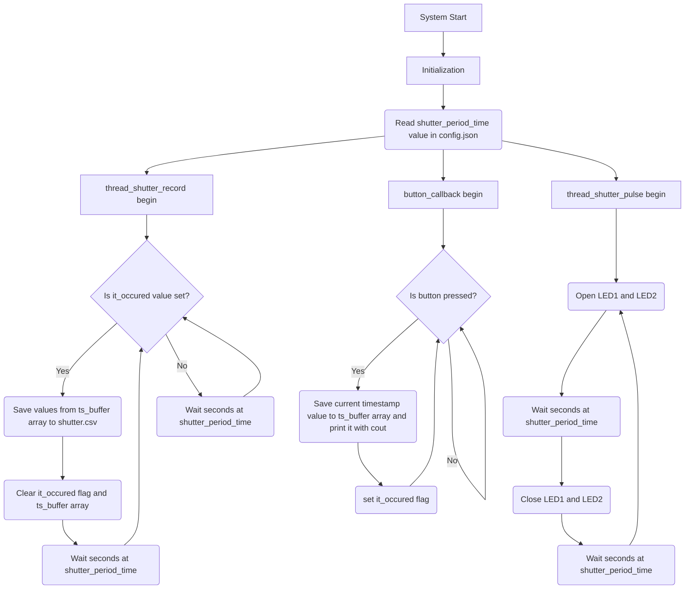

# Alperen-Eroglu-Baykar-Challenge
## Challenge 1
- By using **Thread**, the LEDs are made to blink at intervals of seconds as the **"shutter_period_time"** value in the config.json file.
- Added button **interrupt** and when the interrupt is triggered, **timestamp** value is taken and this value is saved in ts_buffer array.
- By using **Thread**, the values in ts_buffer are saved to the **shutter.csv** file at intervals of seconds (if a button interrupt occurred) as much as the **"shutter_period_time"** value in the config.json file.

### Pinouts

- Led 1 (RED) = 7;
- Led 2 (Green) = 0;
- Button = 2;

> Mode of Leds --> Out
> Mode of Button --> In
> PUPD of Button --> Pull Up

### Config.json

    {"shutter_period_time":1}

### System Images

### FlowChart

## Challenge 2

- Added 9 pin header for SD card connections from camera.
- Added SD card socket to save data from camera to SD card.
- Added GL827L integrated circuit and USB socket to transfer the data from the camera to the computer.
- 74LVC1G18 demultiplexers have been added to transfer the data from the camera to SD card or USB on demand.

### 74LVC1G18 Work Structure

> A --> Camera Pins
> S --> MCU Selection
> 1Y --> SD Card
> 2Y --> SD Card Reader (USB)

As we can see from the table, if the selective value from the MCU pin **is equal to 0**, the data from the camera will be transferred to the **SD card**, if it **is equal to 1**, the data from the camera will be transferred to the **USB**.

### Schematic

### PCB

### 3D PCB

